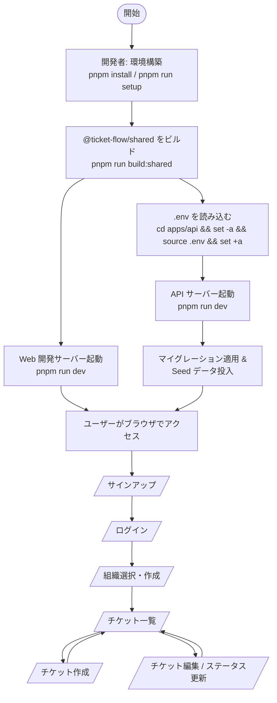
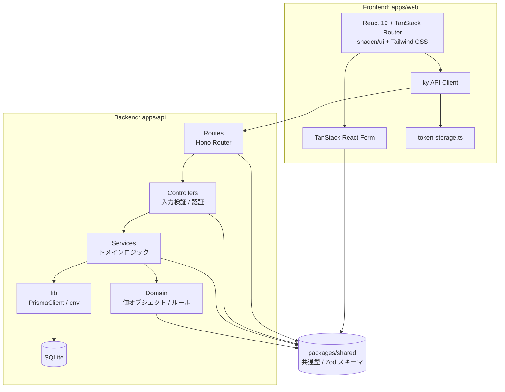

# ticket-flow

マルチテナント SaaS 向けチケット管理システムの基盤プロジェクトです。  
責務分離を意識したレイヤードアーキテクチャを採用し、後続の技術導入を見据えた構造を整備しています。

## プロジェクト概要

- **目的**: チケット管理に必要なドメイン、サービス、コントローラー、ルーティングを明確に分離した基盤を提供する
- **対象**: マルチテナント SaaS
- **設計方針**: 過度な抽象化を避け、必要最小限の構造から始める

## MVP ワークフロー

現在の MVP は「開発者のセットアップ → ユーザー登録 → ログイン → 組織選択 → チケット管理」という流れを想定しています。



### 主な画面遷移

| パス                           | 役割                    |
| ------------------------------ | ----------------------- |
| `/login`                       | ログイン                |
| `/signup`                      | 新規ユーザー登録        |
| `/app`                         | アプリトップ / 組織選択 |
| `/app/$organizationId/tickets` | 組織ごとのチケット一覧  |

## 組織ロールと権限

組織には以下の 4 つのロールがあります。API レイヤーでは `createRequireRoleMiddleware(requiredRole)` を使い、要求されたロール以上であれば操作を許可します。

| ロール（DB/API 値） | 権限の概要               | 例える操作                               |
| ------------------- | ------------------------ | ---------------------------------------- |
| `owner`             | 最上位。全操作が可能     | 組織設定変更、メンバー管理、チケット管理 |
| `admin`             | Owner 専用操作を除き可能 | メンバー招待、チケット管理               |
| `member`            | 閲覧・チケット操作が可能 | チケット作成・編集・コメント             |
| `viewer`            | 閲覧のみ                 | チケット閲覧                             |

Viewer は書き込み操作を行えません。より細かい操作単位の権限制御が必要になった場合は、本ミドルウェアを拡張するか別途 action-based の認可を検討します。

UI 上の権限に応じた表示制御は別途対応します。

## アーキテクチャ概要



### 各レイヤーの役割

| レイヤー       | パッケージ        | 責務                                                     |
| -------------- | ----------------- | -------------------------------------------------------- |
| フロントエンド | `apps/web`        | ユーザーインターフェース、API 呼び出し、フォーム状態管理 |
| バックエンド   | `apps/api`        | HTTP 入力受付、認証、サービス実行、永続化                |
| 共有           | `packages/shared` | フロントエンド・バックエンド双方で使う型と Zod スキーマ  |

### データフロー

1. ユーザーが `apps/web` の画面から入力する
2. `ky` を使って `apps/api` の Hono router にリクエストを送信する
3. 認証が必要なエンドポイントでは、controller が `authMiddleware` で認証した上で service を呼び出す
4. service はドメインルールを使って業務ロジックを実行し、`PrismaClient` でデータを永続化する
5. レスポンスは `packages/shared` の共通型に沿って返却され、フロントエンドで表示する

## 技術スタック

| カテゴリ       | 技術                        | 用途                             |
| -------------- | --------------------------- | -------------------------------- |
| フロントエンド | React 19                    | UI ライブラリ                    |
| フロントエンド | Vite 8                      | ビルドツール / 開発サーバー      |
| フロントエンド | TanStack Router             | ファイルベースルーティング       |
| フロントエンド | TanStack React Form         | フォーム状態管理                 |
| フロントエンド | shadcn/ui + Tailwind CSS v4 | UI コンポーネント / スタイリング |
| フロントエンド | ky                          | HTTP クライアント                |
| バックエンド   | Hono + @hono/node-server    | Web フレームワーク               |
| バックエンド   | Prisma + SQLite             | ORM / データベース               |
| バックエンド   | jose                        | JWT の発行・検証                 |
| バックエンド   | bcrypt                      | パスワードハッシュ化             |
| 共有           | Zod                         | 入力検証 / 型共有                |
| 開発基盤       | TypeScript                  | 言語（厳格モード）               |
| 開発基盤       | pnpm workspaces             | モノレポ管理                     |
| 開発基盤       | Vitest                      | テストランナー                   |
| 開発基盤       | oxlint / oxfmt              | Lint / Format                    |
| 開発基盤       | lefthook / commitlint       | Git フック / コミット検証        |

## ディレクトリ構成

```text
ticket-flow/
├── apps/
│   ├── api/                  # バックエンド API（Hono + Prisma）
│   │   ├── prisma/           # スキーマ・マイグレーション・seed
│   │   ├── src/
│   │   │   ├── routes/        # Hono アプリ・ルーティング定義
│   │   │   ├── controllers/   # 入力検証・認証・レスポンス変換
│   │   │   ├── services/      # ドメインロジック・トランザクション境界
│   │   │   ├── domain/        # エンティティ・値オブジェクト・ドメインルール
│   │   │   └── lib/           # PrismaClient / 環境変数検証
│   │   └── tests/
│   │       ├── unit/         # 単体テスト
│   │       └── integration/  # 統合テスト
│   └── web/                  # フロントエンド（React + Vite）
│       ├── src/
│       │   ├── components/   # UI コンポーネント
│       │   ├── hooks/        # React hooks
│       │   ├── lib/          # API クライアント・ユーティリティ
│       │   ├── mocks/        # MSW ハンドラ
│       │   ├── pages/        # ページコンポーネント
│       │   └── routes/       # TanStack Router ルート
│       └── tests/            # 単体テスト
├── packages/
│   └── shared/               # 共通型・Zod スキーマ
│       ├── src/types/
│       └── src/validation/
└── scripts/                  # ルートスクリプト
```

## セットアップ手順

### 前提条件

- Node.js 最小要件: `>=22.13.0`
- Node.js 推奨バージョン: `.node-version`（nvm 利用時は `.nvmrc`）を参照
- pnpm `11.7.0`（`packageManager` フィールドで固定）

開発環境・CI ともに、`.node-version`（nvm ユーザーの場合は `.nvmrc`）に記載されたバージョンを使用してください。正確なバージョンは各ファイルを参照してください。

```bash
nvm use      # nvm の場合（.nvmrc を読み取ります）
fnm use      # fnm の場合（.node-version を読み取ります）
mise use     # mise の場合（.node-version を読み取ります）
```

### インストール

```bash
# 依存関係をインストール
pnpm install

# lefthook の Git フックをセットアップ（初回のみ）
pnpm run setup

# @ticket-flow/shared を事前にビルド（API 開発 / テスト前に必要）
pnpm run build:shared
```

## ローカル開発手順

```bash
# 1. 環境変数ファイルを作成し、JWT_SECRET を設定する
cp .env.example apps/api/.env
# apps/api/.env の JWT_SECRET を 32 バイト以上の値に変更する

# 2. 依存関係をインストールし、shared をビルドする
pnpm install
pnpm run build:shared

# 3. ターミナル 1: API サーバーを起動（マイグレーション・seed も自動実行）
#    API はコード上で .env を自動読み込みしないため、起動前に環境変数として読み込む
cd apps/api
set -a && source .env && set +a
pnpm run dev

# 4. ターミナル 2: Web 開発サーバーを起動
#    リポジトリルートで実行してください
pnpm run dev
```

`set -a && source .env && set +a` は bash / zsh の例です。`.env` に `export` が付いていない場合でも変数を環境変数としてエクスポートするため、`set -a` が必要です。PowerShell 等をお使いの場合は、`.env` の値を環境変数として読み込んでください。

### 起動後の確認

| サービス | デフォルト URL        | 備考              |
| -------- | --------------------- | ----------------- |
| Web      | http://localhost:5173 | Vite 開発サーバー |
| API      | http://localhost:3000 | Hono + Node.js    |

### 環境変数

#### バックエンド（`apps/api/.env`）

| 変数名                   | 必須 | 例                       | 説明                                                                          |
| ------------------------ | ---- | ------------------------ | ----------------------------------------------------------------------------- |
| `DATABASE_URL`           | 任意 | `file:./dev.db`          | SQLite の接続文字列（`file:` プロトコルのみ許可、未設定時は `file:./dev.db`） |
| `JWT_SECRET`             | 必須 | `your-32-byte-secret...` | 32 バイト以上                                                                 |
| `JWT_ACCESS_EXPIRES_IN`  | 任意 | `15m`                    | アクセストークンの有効期限（未設定時は `15m`）                                |
| `JWT_REFRESH_EXPIRES_IN` | 任意 | `7d`                     | リフレッシュトークンの有効期限（未設定時は `7d`）                             |
| `PORT`                   | 任意 | `3000`                   | API サーバーのポート（未設定時は `3000`）                                     |

#### フロントエンド

| 変数名              | 必須 | 例     | 説明                                                                 |
| ------------------- | ---- | ------ | -------------------------------------------------------------------- |
| `VITE_API_BASE_URL` | 任意 | `/api` | API のベース URL（未設定または空文字の場合 `/api` にフォールバック） |

## データベース

- Prisma + SQLite を使用する
- マイグレーションファイルは `apps/api/prisma/migrations/` で管理する
- 接続先は `DATABASE_URL` で指定する（例: `file:./dev.db`）
- スキーマ変更時は Prisma のマイグレーションコマンドを使用する

```bash
pnpm --filter @ticket-flow/api exec prisma migrate dev --schema prisma/schema.prisma
```

## Seed データ

開発・デモ用の初期データを投入する仕組みです。本番環境（`NODE_ENV=production`）では実行できません。

```bash
cd apps/api

# .env を作成（初回のみ。必要に応じて値を編集）
cp ../../.env.example .env

# 初回または DB ファイルを削除した場合は、先に migrate を適用
pnpm exec prisma migrate deploy --schema prisma/schema.prisma

# 手動で seed を実行
pnpm run db:seed

# または dev 起動時に自動投入（migrate も含む）
pnpm run dev
```

### デモアカウント

| 項目     | 値                 |
| -------- | ------------------ |
| email    | `demo@example.com` |
| password | `demo1234`         |

### 投入されるデータ

- デモユーザー 1 件
- デモチケット 4 件（open / in-progress / closed のステータスを含む）

seed は冪等に実装されており、同じデータが存在する場合は更新されます。

## 開発フロー

1. Issue またはタスクを確認する
2. `.worktrees/<branch-name>/` 以下に作業用 worktree を作成する
3. 対象レイヤーに変更を加える
4. テストを追加・実行し、振る舞いを検証する
5. Conventional Commits に従って commit する（commitlint / lefthook で検証）
6. Pull Request を作成し、レビューを受ける

## ブランチ命名規約

ブランチ名は Conventional Branching に従い、1 つの branch に 1 つの役割を持たせる。

```text
<type>/<issue-number>-<description>
```

Issue 番号がない場合は `<type>/<description>` とする。description は英語の kebab-case、小文字で始める。

### type の一覧

| type        | 用途                       |
| ----------- | -------------------------- |
| `feature/`  | 新機能の開発               |
| `bugfix/`   | バグ修正                   |
| `hotfix/`   | 緊急のバグ修正             |
| `release/`  | リリース準備               |
| `docs/`     | ドキュメントの変更         |
| `style/`    | 振る舞いに影響しない整形   |
| `refactor/` | 構造変更                   |
| `test/`     | テストの追加や修正         |
| `chore/`    | 補助ツールや依存関係の更新 |

### 例

```text
feature/add-user-authentication
bugfix/123-fix-header-alignment
chore/update-markdown-lint-config
```

## コミットメッセージの検証

コミットメッセージは Conventional Commits 形式で記述し、commitlint で検証する。  
ローカルでは lefthook の `commit-msg` フックが自動的に commitlint を実行する。

```bash
# lefthook の Git フックを手動でセットアップする
pnpm run setup

# 直前のコミットメッセージを手動で検証する
pnpm run commitlint

# CI では lefthook のフックを無効化している
```

## レイヤーの責務

- `routes`: Hono アプリ・ルーティング定義を置く
- `controllers`: 入力検証・認証・レスポンス変換を行い、service を呼び出す
- `services`: ドメインロジックとトランザクション境界を置く
- `domain`: ドメインルールと不変条件を表現する
- `lib`: `PrismaClient` や環境変数検証などの基盤詳細を閉じ込める

## 主要な設計決定事項

| 決定事項                     | 選定                              | 理由                                                                                                                        |
| ---------------------------- | --------------------------------- | --------------------------------------------------------------------------------------------------------------------------- |
| データベース                 | Prisma + SQLite                   | MVP 期は運用負荷を抑えつつ、型安全な ORM とマイグレーション管理を得るため。将来的な RDBMS 移行も Prisma により容易に行える  |
| フロントエンドフレームワーク | React 19                          | 並列レンダリングなどの最新機能を活用し、将来の拡張に備えるため                                                              |
| ルーティング                 | TanStack Router（ファイルベース） | ルート定義とファイル配置を一致させ、新規開発者が画面構成を把握しやすくするため                                              |
| スタイリング                 | Tailwind CSS v4 + shadcn/ui       | ユーティリティファーストで一貫したデザインを保ち、shadcn/ui でアクセシビリティを担保したコンポーネントを組み立てるため      |
| HTTP クライアント            | ky                                | `fetch` ベースで軽量かつ、Bearer ヘッダー付与・401 時のリトライなどを簡潔に実装できるため                                   |
| 認証トークン保存             | メモリ上のみ                      | localStorage 等への永続化を避け、XSS によるトークン漏洩リスクを減らすため（現時点ではページリロードでログインが解除される） |
| 入力検証                     | Zod in `packages/shared`          | フロントエンドとバックエンドで同一の検証ルールを再利用し、不整合を防ぐため                                                  |
| モノレポ管理                 | pnpm workspaces                   | フロントエンド・バックエンド・共有パッケージを同一リポジトリで一貫管理し、型共有とビルド連携を容易にするため                |
| アーキテクチャ               | レイヤードアーキテクチャ          | routes / controllers / services / domain / lib を分離し、テスト容易性と保守性を高めるため                                   |
